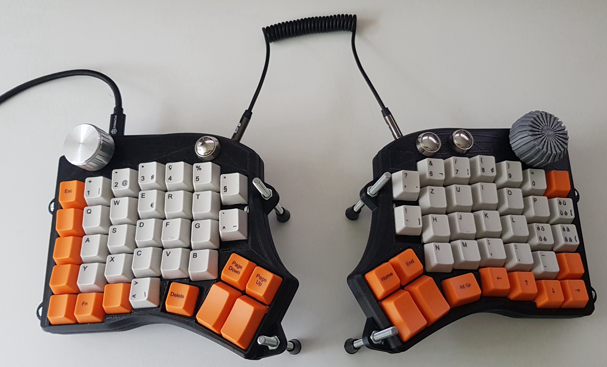
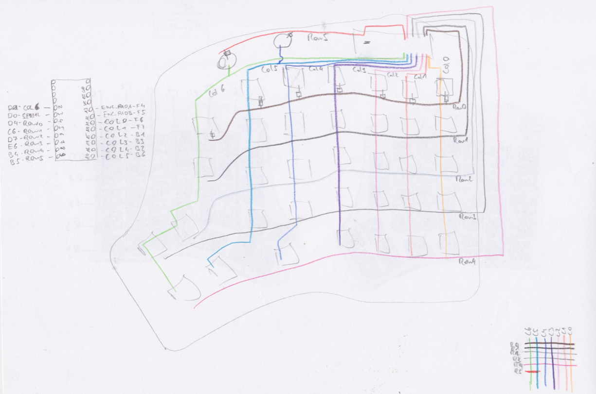
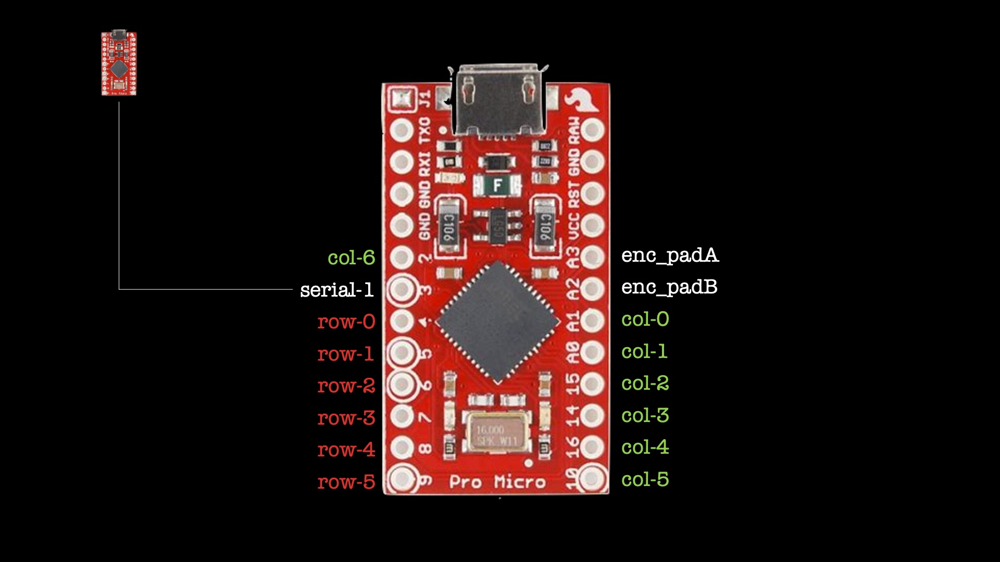

# Redox Media Keyboard

I've made a custom adaptation of the [Redox](https://hackaday.io/project/160610-redox-keyboard) keyboard, accommodating media buttons as well as a volume knob and a scroll wheel.

## Detailed report and video
I've written a detailed article and created a video explaining the pros and cons of such a keyboard as well as a build and programming guide.

## Wiring diagram
Keyboards are typically wired in a matrix, where every switch is connected to 1 row and 1 column. If the microcontroller detects a connection between a row and a column, it identifies which key is pressed. The ---------------VIDEO--------------- explains the wiring in more detail with useful hints of how to prepare the wires.

The wiring diagrams from the Redox community can be found [here](https://hackaday.io/project/160610/logs?sort=oldest)

## Programming
The keyboard software is based on the QMK framework, as is the original Redox. I've submitted a PR to QMK adding a media layout and corresponding key map. Also instructions to apply and flash the firmware are layed out there, refer to the [Redox Media section in the QMK repo](https://github.com/qmk/qmk_firmware/tree/master/keyboards/redox/) --------------- update link ------------------

## Bill of material
- [key tester](https://www.amazon.fr/AKWOX-M%C3%A9canique-Interrupteurs-Dampeners-Extracteur/dp/B01GZHU1EG/ref=sr_1_2?__mk_fr_FR=%C3%85M%C3%85%C5%BD%C3%95%C3%91&dchild=1&keywords=keyboard%2Btester&qid=1592215220&sr=8-2)
- [sample switches](https://www.pcgamingrace.com/products/glorious-mx-switch-sample-pack)
- [switches (Kailh Pro Purple)](https://www.digitec.ch/de/s1/product/glorious-pc-gaming-race-kailh-pro-purple-switches-120-stueck-maus-tastatur-zubehoer-12826227)
- [Sparkfun pro micro 5V 2x](https://www.play-zone.ch/de/sparkfun-arduino-pro-micro-5v-16mhz.html)
- [curled 3.5mm cable](https://www.brack.ch/hama-audio-kabel-klinke-3-182926)
- [rotary encoder 2x](https://www.digitec.ch/de/s1/product/velleman-digital-rotary-encoder-modul-entwicklungsboard-kit-12256627)
- [shape cable](https://www.fust.ch/de/p/pc-tablet-handy/pc-komponenten/kabel-adapter/delock/usb-otg-kabel-microb-shapecable-0-15-m-8289927.html)
- [1N4148-200mA diodes (as many as you intend to use switches)](https://www.amazon.fr/dp/B07CTW5L3W/ref=pe_3044141_185740131_TE_item)
- [media buttons](https://www.aliexpress.com/item/32908474287.html)
- [micro USB cable](https://www.amazon.fr/dp/B07Q5NQFL1/ref=pe_3044141_185740131_TE_item)
- volume knob
- 5mm threaded rod with nuts
- hook up wire (ideally multiple colors)

## CAD files
The original Redox CAD files (SCAD) are open source and available [here](https://github.com/Lenbok/scad-keyboard-cases). I've modified those adding some extra space at the top to accommodate the media buttons and two knobs as well as a mechanical housing for a micro-USB shape cable as the pro micro has a somewhat fragile micro-USB port.